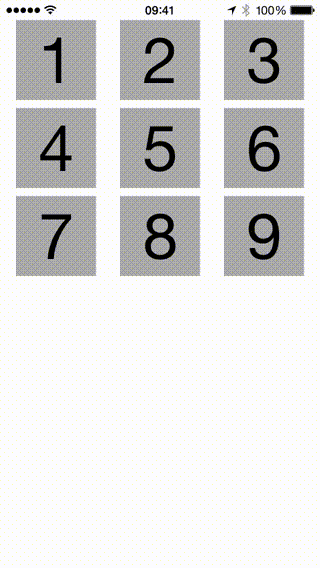

LP3DResponsiveView
====================================

Responsive for touches UIControl. Rotates view's layer in 3D depending on touch location.

Available customizations:

* maximum duration of animation (property maxAnimationDuration)
* maximum rotation angle (property maxRotationAngle)

## Using

Copy **LP3DResponsiveView.h** and **LP3DResponsiveView.m** into your project and use it like other controls. 